<div align="center">

# Skill Swarm

**MCP server for AI agent skill discovery, installation, and orchestration.**

[](LICENSE)
[](https://python.org)
[](https://modelcontextprotocol.io)
[]()

</div>

---

## The Problem

AI agents (Claude, Gemini, Copilot) need skills to be effective. Today, finding and installing the right MCP server for a task is manual:

1. Search Smithery/GitHub manually
2. Evaluate if the server is trustworthy (stars? license? maintained?)
3. Install and configure it by hand
4. Repeat for every project

**Skill Swarm automates the entire pipeline.** The agent asks "I need to parse PDFs" and Skill Swarm searches 5 registries (Skills.sh, MCP Registry, Smithery, Glama, GitHub), evaluates trust, installs the best match, and makes it available instantly.

---

## How It Works

```mermaid
flowchart TD
    A["🤖 Agent asks:<br/>'I need database access'"] --> B{match_skills}
    B -->|Local skill found| C["✅ Use it"]
    B -->|No match| D[search_skills]
    D --> E["5 registries<br/>in parallel"]
    E --> F[install_skill]
    F --> G["download"]
    G --> H["security scan"]
    H --> I["trust check"]
    I --> J["install"]
    J --> K["symlink"]
    K --> L["~/.agent/skills/{name}/skill.md"]
    C --> M{Need partial context?}
    M -->|Yes| N[cherry_pick_context]
    M -->|No| O["📄 Full skill loaded"]
    N --> P["Extract only<br/>sections you need"]

    style A fill:#8B5CF6,stroke:#6D28D9,color:#fff
    style C fill:#10B981,stroke:#059669,color:#fff
    style L fill:#10B981,stroke:#059669,color:#fff
    style F fill:#3B82F6,stroke:#2563EB,color:#fff
    style D fill:#3B82F6,stroke:#2563EB,color:#fff
    style N fill:#F59E0B,stroke:#D97706,color:#fff
```



### Architecture


### Install Pipeline

```mermaid
sequenceDiagram
    participant A as AI Agent
    participant S as skill-swarm
    participant R as Registries
    participant G as GitHub API
    participant FS as Filesystem

    A->>S: install_skill("pdf-parser", url)
    S->>S: Download source
    S->>S: Security scan (pattern matching)
    alt scan fails
        S-->>A: ❌ Blocked (security_score < 0.5)
    end
    S->>G: GET /repos/{owner}/{repo}
    G-->>S: stars, license, pushed_at, archived
    S->>S: Compute trust score (5 dimensions)
    S->>FS: Write ~/.agent/skills/pdf-parser/skill.md
    S->>FS: Symlink ~/.claude/skills/pdf-parser → source
    S->>FS: Symlink ~/.gemini/skills/pdf-parser → source
    S->>S: Update manifest.json + usage tracker
    S->>S: Purge search cache
    S-->>A: ✅ InstallResult (path, agents, scores)
```



---

## Quick Start

### Prerequisites

- **Python 3.13+**
- **Git** (for cloning skill sources)
- **GitHub token** (optional, for 5000 req/hr vs 60)

### Installation

```bash
git clone https://github.com/ancrz/skill-swarm-mcp.git
cd skill-swarm-mcp

# Create virtual environment and install
python3.13 -m venv .venv
source .venv/bin/activate
pip install -e .

# Configure environment
cp .env.example .env
# Edit .env and add your GitHub token
```

### Configure Your AI Agent

Skill Swarm uses **stdio** transport — the AI client launches the Python process and communicates via stdin/stdout. This means the client is responsible for starting the server and passing environment variables.

> **How secrets work with stdio:** Because the client spawns the process, the `env` block in the JSON config injects variables into the server's memory before execution. This is the preferred method for Claude and Gemini CLI. For sandboxed agents (Antigravity), use a `.env` file instead (see below).

---

#### Claude Code

Claude Code fully supports `type`, `command`, `args`, and `env` fields.

**Global** (`~/.claude.json`):

```json
{
  "mcpServers": {
    "skill-swarm": {
      "type": "stdio",
      "command": "/path/to/skill-swarm-mcp/.venv/bin/python",
      "args": ["-m", "skill_swarm.server"],
      "env": {
        "SKILL_SWARM_GITHUB_TOKEN": "ghp_your_token_here"
      }
    }
  }
}
```

**Project-level** (`.mcp.json` in your project root):

```json
{
  "mcpServers": {
    "skill-swarm": {
      "command": "/path/to/skill-swarm-mcp/.venv/bin/python",
      "args": ["-m", "skill_swarm.server"],
      "env": {
        "SKILL_SWARM_GITHUB_TOKEN": "ghp_your_token_here"
      }
    }
  }
}
```

---

#### Gemini CLI

Gemini CLI infers transport from the field used — `command` = stdio. No `type` field needed. The `env` block works and supports `$VAR` / `${VAR}` substitution from host environment.

**Config file:** `~/.gemini/settings.json`

```json
{
  "mcpServers": {
    "skill-swarm": {
      "command": "/path/to/skill-swarm-mcp/.venv/bin/python",
      "args": ["-m", "skill_swarm.server"],
      "env": {
        "SKILL_SWARM_GITHUB_TOKEN": "ghp_your_token_here"
      }
    }
  }
}
```

> **Note:** Omit `"type": "stdio"` — Gemini CLI infers it from `command`. Adding it may cause validation errors on older CLI versions.

---

#### Antigravity

Antigravity runs agents in a **sandboxed environment** (Docker or local). If the agent doesn't have your home directory mounted, absolute paths to the Python binary will fail. Additionally, `env` injection from the JSON may be restricted in sandboxed mode.

**Recommended approach:** Put the GitHub token in the `.env` file inside the skill-swarm directory so the server reads it from disk (Pydantic Settings loads `.env` automatically):

```bash
# /path/to/skill-swarm-mcp/.env
SKILL_SWARM_GITHUB_TOKEN=ghp_your_token_here
```

**Config file:** `~/.gemini/antigravity/mcp_config.json`

```json
{
  "mcpServers": {
    "skill-swarm": {
      "command": "/path/to/skill-swarm-mcp/.venv/bin/python",
      "args": ["-m", "skill_swarm.server"]
    }
  }
}
```

> **Note:** No `env` block — the server reads credentials from its `.env` file. Make sure the path to the Python binary is accessible from the agent's execution context.

---

#### Quick Comparison

|                    | Claude Code                     | Gemini CLI                     | Antigravity                             |
| ------------------ | ------------------------------- | ------------------------------ | --------------------------------------- |
| **Config file**    | `~/.claude.json` or `.mcp.json` | `~/.gemini/settings.json`      | `~/.gemini/antigravity/mcp_config.json` |
| **Transport**      | `"type": "stdio"` (explicit)    | Inferred from `command`        | Inferred from `command`                 |
| **`env` in JSON**  | Yes                             | Yes (with `$VAR` substitution) | Possible but prefer `.env` file         |
| **`type` field**   | Supported                       | Omit (inferred)                | Not used                                |
| **Secrets method** | `env` block in JSON             | `env` block in JSON            | `.env` file on disk                     |

### Verify

```bash
# Run tests
.venv/bin/python tests/test_core.py

# Test the MCP server responds
echo '{"jsonrpc":"2.0","id":1,"method":"initialize","params":{"capabilities":{}}}' | \
  .venv/bin/python -m skill_swarm.server
```

---

## 8 Tools Reference

| Tool                    | Description                              | Key Args                        |
| ----------------------- | ---------------------------------------- | ------------------------------- |
| **search_skills**       | Search 5 registries with trust scoring   | `query`, `scope`, `limit`       |
| **match_skills**        | BM25F + 7-signal local matching          | `task_description`, `threshold` |
| **install_skill**       | Download, scan, trust-check, install     | `name`, `source`, `agents`      |
| **uninstall_skill**     | Remove skill + symlinks + tracking       | `name`                          |
| **list_skills**         | Inventory with health and usage stats    | `agent`                         |
| **get_skill_info**      | Full metadata + content of a skill       | `name`                          |
| **cherry_pick_context** | Extract specific markdown sections       | `skill_name`, `sections`        |
| **skill_health**        | Usage analytics and dead skill detection | _(none)_                        |

See [TOOLS.md](TOOLS.md) for complete parameter reference and examples.

---

## Skill Directory Compliance

Skills follow the `.agent` standard for cross-agent compatibility:

```
~/.agent/skills/                    # Global source of truth
├── {skill-name}/
│   └── skill.md                    # Skill content (always skill.md)
├── manifest.json                   # Installed skills registry
├── .usage.json                     # Usage tracking data
└── .cache/                         # TTL-based search/trust cache

~/.claude/skills/                   # Agent-specific (symlinks)
├── {skill-name} -> ~/.agent/skills/{skill-name}
└── ...

~/.gemini/skills/                   # Agent-specific (symlinks)
├── {skill-name} -> ~/.agent/skills/{skill-name}
└── ...
```

- The **folder name** identifies the skill
- The **file** is always `skill.md` (standard compliance)
- Agent directories contain **directory symlinks** to the global source
- Any agent that follows the `.agent/skills/` convention can consume skills

---

## Trust Score Engine

Every remote search result includes a trust score (0.0-1.0) computed from 5 git-quality dimensions:


| Dimension        | Weight | Signals                                                            |
| ---------------- | ------ | ------------------------------------------------------------------ |
| **Recency**      | 0.20   | Exponential decay since last push (half-life: 180 days)            |
| **Popularity**   | 0.20   | Log-normalized stars, forks, watchers                              |
| **Maintenance**  | 0.25   | Push frequency, open issues ratio                                  |
| **Security**     | 0.25   | License trust level (MIT=1.0, GPL=0.5, none=0.1), archived penalty |
| **Completeness** | 0.10   | Description, homepage, topics, README presence                     |

**Verdicts:**

| Score     | Verdict     | Action                    |
| --------- | ----------- | ------------------------- |
| >= 0.75   | **TRUST**   | Safe to auto-install      |
| 0.50-0.74 | **CAUTION** | Show to agent for review  |
| 0.25-0.49 | **WARNING** | Manual review recommended |
| < 0.25    | **REJECT**  | Block installation        |

---

## Matcher V2 — BM25F + Multi-Signal Scoring

Local skill matching uses 7 weighted signals:

```mermaid
graph LR
    Q["Query"] --> E["Exact Match<br/>w=30"]
    Q --> P["Prefix Match<br/>w=20"]
    Q --> PH["Phrase Match<br/>w=15"]
    Q --> B["BM25F<br/>w=15"]
    Q --> J["Jaccard Tags<br/>w=10"]
    Q --> FN["Fuzzy Name<br/>w=7"]
    Q --> FD["Fuzzy Desc<br/>w=3"]

    E --> S["Σ Weighted Score<br/>0.0 – 1.0"]
    P --> S
    PH --> S
    B --> S
    J --> S
    FN --> S
    FD --> S

    style Q fill:#8B5CF6,stroke:#6D28D9,color:#fff
    style S fill:#10B981,stroke:#059669,color:#fff
    style E fill:#EF4444,stroke:#DC2626,color:#fff
    style P fill:#F97316,stroke:#EA580C,color:#fff
    style B fill:#3B82F6,stroke:#2563EB,color:#fff
```



| Signal            | Weight | Description                                          |
| ----------------- | ------ | ---------------------------------------------------- |
| Exact match       | 30     | Query equals skill name                              |
| Prefix match      | 20     | Skill name starts with query                         |
| Phrase match      | 15     | Query found as substring in any field                |
| BM25F             | 15     | Field-weighted relevance (name=3x, tags=2x, desc=1x) |
| Jaccard tags      | 10     | Set similarity on tags                               |
| Fuzzy name        | 7      | Typo-tolerant name matching (rapidfuzz)              |
| Fuzzy description | 3      | Partial match on description                         |

BM25F parameters optimized for small corpus (10-100 skills): k1=1.2, b=0.3.

---

## Platform Support

| Platform    | Status       | Notes                                 |
| ----------- | ------------ | ------------------------------------- |
| **Linux**   | Full support | Primary development platform          |
| **macOS**   | Full support | Same Python ecosystem                 |
| **Windows** | Full support | Native symlinks supported (see below) |

### Windows Symlinks

Skill Swarm uses directory symlinks (`os.symlink`) to share skills across agents. Windows supports native NTFS symlinks:

| Windows Version                   | Requirement                                                              |
| --------------------------------- | ------------------------------------------------------------------------ |
| **Windows 11**                    | No configuration needed — symlinks work for all users                    |
| **Windows 10** (Creators Update+) | Enable **Developer Mode**: Settings → Update & Security → For Developers |
| **Windows 10** (older builds)     | Run as Administrator                                                     |

Python's `os.symlink()` works natively on Windows when the above permissions are met. No WSL required.

**Manual creation** (if needed):

```powershell
# PowerShell
New-Item -ItemType SymbolicLink -Path "$HOME\.claude\skills\my-skill" -Target "$HOME\.agent\skills\my-skill"

# Command Prompt (Administrator)
mklink /D "%USERPROFILE%\.claude\skills\my-skill" "%USERPROFILE%\.agent\skills\my-skill"
```

**AI Agent Compatibility:**

| Agent             | Integration                   | Symlink Dir         |
| ----------------- | ----------------------------- | ------------------- |
| **Claude Code**   | MCP stdio                     | `~/.claude/skills/` |
| **Gemini**        | MCP stdio                     | `~/.gemini/skills/` |
| **Custom agents** | Add to `agent_dirs` in config | Configurable        |

---

## Configuration Reference

All settings are loaded from environment variables (prefix: `SKILL_SWARM_`):

| Variable                               | Default   | Description                                  |
| -------------------------------------- | --------- | -------------------------------------------- |
| `SKILL_SWARM_GITHUB_TOKEN`             | _(empty)_ | GitHub PAT for API access (5000 req/hr)      |
| `SKILL_SWARM_CACHE_SEARCH_TTL`         | `3600`    | Search cache TTL in seconds                  |
| `SKILL_SWARM_CACHE_TRUST_TTL`          | `86400`   | Trust score cache TTL in seconds             |
| `SKILL_SWARM_SEARCH_TIMEOUT`           | `15.0`    | HTTP timeout for registry queries            |
| `SKILL_SWARM_SEARCH_MAX_RESULTS`       | `10`      | Max results per search                       |
| `SKILL_SWARM_SECURITY_THRESHOLD`       | `0.5`     | Min security scan score to install           |
| `SKILL_SWARM_SKILLSSH_ENABLED`         | `true`    | Enable Skills.sh as primary registry         |
| `SKILL_SWARM_SKILLSSH_NPX_PATH`        | `npx`     | Path to npx binary for `skills find`         |
| `SKILL_SWARM_SKILLSSH_GITHUB_FALLBACK` | `true`    | Use GitHub topic search when npx unavailable |
| `SKILL_SWARM_SKILLSSH_SEARCH_TIMEOUT`  | `30.0`    | Timeout for npx subprocess calls             |

---

## Project Structure

```
skill-swarm/
├── src/skill_swarm/
│   ├── server.py              # FastMCP entry point (8 tools)
│   ├── config.py              # Pydantic Settings + path helpers
│   ├── models.py              # Data models (SkillInfo, TrustScore, etc.)
│   ├── core/
│   │   ├── scanner.py         # Security pattern scanner
│   │   ├── matcher.py         # BM25F + multi-signal scoring
│   │   ├── installer.py       # Download, scan, install pipeline
│   │   ├── registry.py        # 5-registry parallel search (Skills.sh primary)
│   │   ├── trust.py           # Git-quality trust scoring engine
│   │   ├── cache.py           # TTL file-based cache
│   │   └── usage.py           # Skill usage tracking
│   └── tools/
│       ├── search.py          # search_skills implementation
│       ├── install.py         # install/uninstall wiring
│       ├── inventory.py       # list/match/get_info wiring
│       └── cherry_pick.py     # Section extraction
├── skill/
│   ├── SKILL.md               # Self-describing skill file
│   └── references/            # Skill reference docs
├── tests/
│   ├── test_core.py           # Unit tests (8)
│   ├── test_e2e_effectiveness.py  # E2E V1 (19 tests)
│   └── test_e2e_v2.py         # E2E V2 — trust, cache, BM25F (15 tests)
├── LICENSE                    # Apache 2.0
├── README.md                  # This file
├── TOOLS.md                   # Complete tool reference
├── pyproject.toml             # Python package config
├── .env.example               # Environment template
├── .mcp.json                  # MCP server config
└── .gitignore
```

---

## Development

```bash
# Install with dev dependencies
pip install -e .

# Run all tests (42 total)
.venv/bin/python tests/test_core.py           # 8 unit tests
.venv/bin/python tests/test_e2e_effectiveness.py  # 19 E2E V1
.venv/bin/python tests/test_e2e_v2.py         # 15 E2E V2

# Test a single search
.venv/bin/python -c "
import asyncio, sys, json
sys.path.insert(0, 'src')
from skill_swarm.tools.search import search_skills
results = asyncio.run(search_skills('filesystem', scope='remote', limit=3))
for r in results:
    trust = r.trust.score if r.trust else 'N/A'
    print(f'{r.name} ({r.source}) trust={trust}')
"
```

---

## License

Apache License 2.0 — see [LICENSE](LICENSE) for details.

```
Copyright 2025 Anthony Cruz
```

<div align="center">

**Built with MCP Protocol and AI-assisted engineering.**

[⬆ Back to Top](#skill-swarm)

</div>
