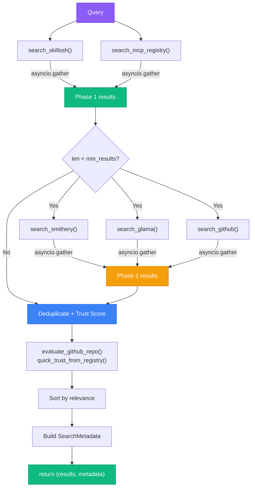

# Spec: Two-Phase Search Orchestration

## Overview

This spec documents the two-phase search orchestration pattern implemented in `search_remote_phased()`. It bridges the Claude Code Swarm paradigm (multi-agent pipelines, parallel specialists) to a concrete Python/MCP implementation.

---

## Pattern: Two-Phase Search

### Phase 1 — High-Trust Registries (always executed)

Sources: **Skills.sh** + **Official MCP Registry**

- Executed in parallel via `asyncio.gather()`
- These registries carry the highest trust signal weight (0.85-0.95 relevance baseline)
- Skills.sh is the primary target: purpose-built for agent skills, installs are a proxy for real-world usage
- MCP Registry is curated by the Anthropic/Agentic AI Foundation

### Phase 2 — Lower-Trust Registries (conditional)

Sources: **Smithery** + **Glama** + **GitHub**

- Triggered only when Phase 1 returns fewer than `search_phase1_min_results` valid results (default: 3)
- Also executed in parallel via `asyncio.gather()`
- Lower relevance baselines (0.50-0.70): more general, less skill-specific
- Avoids unnecessary latency for common queries that Phase 1 covers well

### Trigger Condition

```python
phase2_triggered = len(phase1_results) < settings.search_phase1_min_results
```

Default threshold: `3`. Configure via `SKILL_SWARM_SEARCH_PHASE1_MIN_RESULTS`.

---

## Flow Diagram



---

## Failure Semantics

- `asyncio.gather(..., return_exceptions=True)` — individual registry failures are silently skipped
- The function **never raises** under any circumstances
- On total failure: returns `([], SearchMetadata(all_failed=True))`
- On partial failure: proceeds with available results
- Errors are demoted to `logger.warning()` inside each registry client

---

## SearchMetadata

`SearchMetadata` captures observability state for each invocation:

| Field               | Type        | Description                                      |
|---------------------|-------------|--------------------------------------------------|
| `phase1_sources`    | `list[str]` | Always `["skillssh", "mcp_registry"]`            |
| `phase2_sources`    | `list[str]` | `["smithery", "glama", "github"]` or `[]`        |
| `phase1_results`    | `int`       | Count of results from Phase 1 (pre-dedup)        |
| `phase2_results`    | `int`       | Count of results from Phase 2 (pre-dedup)        |
| `phase1_duration_ms`| `float`     | Wall-clock time for Phase 1 gather               |
| `phase2_duration_ms`| `float`     | Wall-clock time for Phase 2 gather (0 if skipped)|
| `total_duration_ms` | `float`     | Sum of both phases (not including trust scoring) |
| `all_failed`        | `bool`      | True when both phases returned 0 results         |

---

## Mapping: Claude Code Swarm Patterns → Python/MCP

| Swarm Pattern            | Implementation in skill-swarm                            |
|--------------------------|----------------------------------------------------------|
| **Pipeline Pattern**     | Two-phase search: Phase 1 output decides Phase 2 trigger |
| **Parallel Specialists** | `asyncio.gather()` per phase — each registry is a specialist |
| **Result Aggregator**    | Deduplication + trust scoring merges specialist outputs  |
| **Adaptive Dispatch**    | `search_phase1_min_results` threshold = adaptive trigger |
| **Metadata Carrier**     | `SearchMetadata` = structured observability per invocation |

---

## Configuration

| Variable                                  | Default | Effect                            |
|-------------------------------------------|---------|-----------------------------------|
| `SKILL_SWARM_SEARCH_PHASE1_MIN_RESULTS`   | `3`     | Phase 2 triggers below this count |

---

## Transparency to MCP Consumers

`search_skills()` in `tools/search.py` calls `search_remote_phased()` but returns only `list[SearchResult]`. The `SearchMetadata` is consumed internally for logging. MCP consumers see no schema change.
